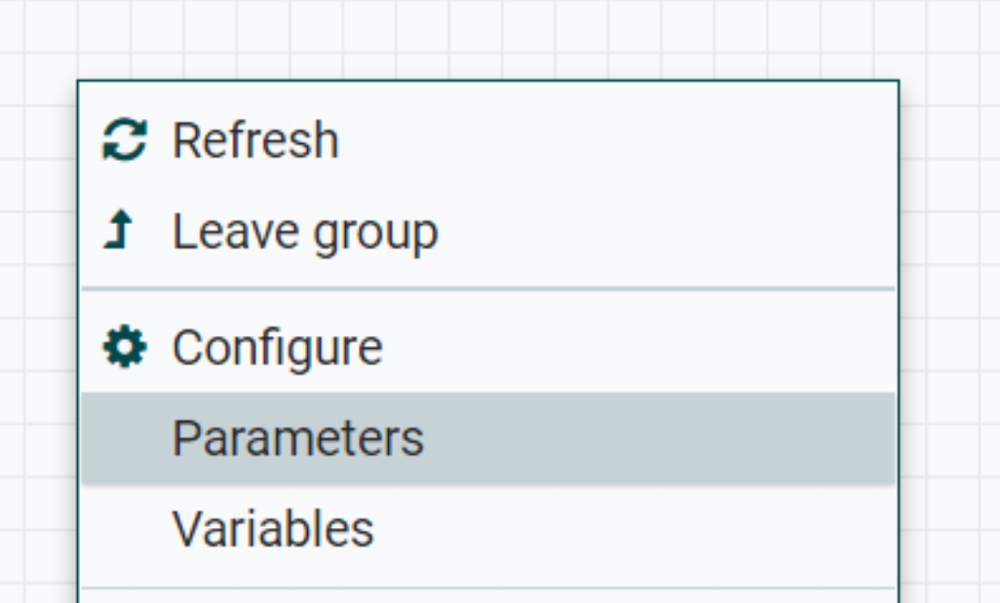

# Nifi Documentation

The nifi implementation reads data from camunda postgres database and writes to the analytics database.

## **Table of Contents**
1. [Setup](#setup)
   * [Nifi Configuration](#nifi-Configuration)
        * [Controller Services](#controller-services)
        * [Parameter Context and Parameters](#parameter-context)
        * [Nifi Registry](#nifi-registry)
   * [Camunda POSTGRES setup](#camunda-POSTGRES-setup)
        * [Step 1: Create analytics tables](#step-1-create-analytics-tables)
        * [Step 2: Add column nifi_entry_id](#step-2-add-column-nifi_entry_id)
2. [Nifi Flow Description](#nifi-flow-description)  
3. [Error Notifications](#error-notifications)
4. [How to debug?](#how-to-debug)
    * [Data has not been written to analytics](#data-has-not-been-written-to-analytics)
    * [Data has been written to analytics](#data-has-been-written-to-analytics)
5. [Logging](#logging)

---

## **Setup**

### **Nifi Configuration**

The nifi configuration involves 
- Controller Services (Background services that the processors need for successful execution)
- Parameters and Parameter Context (Environment variables)
- Nifi Registry (For versional control)

#### **Controller Services**

The following background services are needed for the processors in the flow to execute successfully.
| Name | Processor | Description |
| ----------- | ----------- | ----------- |
| AnalyticsMSSQLConnectionPool | DBCPConnectionPool | Provides DB connection pool for Analytics |
| PostGresConnectionPool  | DBCPConnectionPool | Provides DB connection pool for Camunda |
| JsonRecordSetWriter  | JsonRecordSetWriter | Used for selecting by pid from analytics DB |
| PostgresToAnalyticsCacheServer  | DistributedMapCacheServer | Provides cache server |
| PostgresToAnalyticsCacheClient  | DistributedMapCacheClientService | Provides cache client |
| JsonTreeReader  | JsonTreeReader | Used for Delete from Postgres |


#### **Parameter Context**

A parameter context is set up so that several parameters that enable this flow can be added. The parameters basically act like environment variables and the parameter context ensures that these parameters are only accessible from processors using this context.


Following are the parameters:

*Camunda Database:*

- PG_DRIVER_LOCATION: /opt/nifi/data/extensions/
- PG_BC_HOST_PORT: formsflowai-rw.e69aae-test.svc:5432
- PG_BC_DATABASE: `<camunda database>`
- PG_BC_USERNAME: `<Postgres username>`

*Analytics Database:*
- MSSQL_DRIVER_LOCATION: /opt/nifi/data/extensions/mssql-jdbc-10.2.0.jre8.jar
- MSSQL_USERNAME: `<Analytics Username>`
- MSSQL_DATABASE: `<Analytics database name>`
- MSSQL_HOST_PORT: `<IP ADDRESS and PORT>`
- MSSQL_DRIVER_CLASS_NAME: com.microsoft.sqlserver.jdbc.SQLServerDriver

*Email notifications:*
- SMTP_USERNAME: dotnotreply@gov.bc.ca
- SMTP_HOST: `<value>`
- SMTP_PORT: 25
- SMTP_NOTIFICATION_ENABLED: true
- SMTP_NOTIFICATION_EMAIL: `<comma separated emails>`
- SMTP_FROM_EMAIL: donotreply@gov.bc.ca

*Teams notifications:*
- MICROSOFT_TEAMS_NOTIFICATION_ENABLED: true
- MST_NOTIFICATION_WEBHOOK: `<Teams Webhook URL>`

*Others:*
- CACHE_LOCATION: ./data/cache
- ERROR_NOTIFICATION_TITLE: Nifi: (test) Message from pipeline



**Passwords:**

The database passwords must be entered into the password field of the database controllers. They are not set up in the parameters to avoid exposure. Refer the following image to see how to set up the password.


#### **Nifi Registry**

Nifi registry is used for version control of the flow. This can be set up by going to the `Controller Settings` as shown in the image below.


Under `Registry Clients`, click on the `plus` icon at the right hand side and add the nifi registry url.


---

### **Camunda POSTGRES setup**

#### **Step 1: Create analytics tables**
Every analytics table in use must have a corresponding table in the camunda database. This can be done by generating the DDL from analytics and setting up the necessary tables in postgres.

#### **Step 2: Add column `nifi_entry_id` and make it the primary key**
Every table must have a new column called nifi_entry_id. The datatype in postgres for this column is `serial`. Use the following query to alter the table structure:

```
alter table {tablename}
add column nifi_entry_id serial;
```

*What is the purpose of this `nifi_entry_id` column?*

This is an autoincrementing column which is used by the `QueryDatabaseRecord` processor to keep track of which row was last read so that the same row does not keep getting read repeatedly.

---

#### **Step 3: Remove `pid` as primary key**
During testing, there were situations when the camunda postgres would throw a `DuplicateKeyException` when a task is quickly escalated from one level to another. Since `nifi_entry_id` is unique too, it can be made the primary key.

## **Nifi Flow Description**

The fundamental steps for this nifi flow involves just four stages:
- Read data from camunda table (identified uniquely by the `pid` (process id))
    - This stage includes datatype conversions required.
- Check if the `pid` already exists in the analytics table
- Write the data to the analytics table
    - `INSERT`, If the `pid` does not exist
    - `UPDATE`, If the `pid` exists
- Delete from the camunda table the row corresponding to `pid`

---

## **Error Notifications**

- Email notifications will be sent to the email addresses configured in `SMTP_NOTIFICATION_EMAIL` parameter if `SMTP_NOTIFICATION_ENABLED` is `true`.
- Teams notifications will be posted if `MICROSOFT_TEAMS_NOTIFICATION_ENABLED` is `true` and `MST_NOTIFICATION_WEBHOOK` configured to a teams webhook (URL).

Error Notification Structure:
```
Process ID (pid): <pid value>
table: <table name>
Error Overview: <An overview of the error indicating what went wrong>
Nifi Processor: <The nifi processor that failed>
Error Description: <A detailed description of the error to help understand the execution context>
Possible Actions: <One or more steps one could take to debug the issue>
Technical Error: <Exception message or stack if available; otherwise N/A>
```

---

## **How to debug?**

To simplify debugging, the failures are classified into two:
- Data has not been written to analytics
- Data has been written to analytics

The error notification email and Teams post contain both `pid` and `table` fields which can be used as input.

### ***Data has not been written to analytics:***

Use the `QueryDatabaseTable` processor with the title `(Debug Workflow) Query Any Table - Edit before execution`


Input required:
- `pid` - Enter this value in the `Additional WHERE clause`.
- `table name`: Enter this value in `Table Name` property.

Refer the following image to locate the `pid` and `table name` fields.


Debugging Steps:

    1. Update the Table Name field
    2. Update the `pid` in the Additional WHERE clause field.
    3. Run the processor once (Right Click -> Run Once)
    4. Stop the processor after the data is read (If not already)
    5. Clear out the Table name and `pid` (with a placeholder)

**NOTE:**

STOP the processor after the data has been read from the table. 

*Why stop the processor?*

For debugging, `nifi_entry_id` is not configured into the processor which keeps track of the last row read from the table. Not stopping will lead to the same row being read repeatedly.

To allow time for obeserving the flow, the processor is scheduled to execute only once every 10 minutes. This allows sufficient time to stop the processor. 

### ***Data has been written to analytics***

The only failure possible here is failure to delete data from the camunda table.

Use the `GenerateFlowFile` processor with the title `(Debug Workflow) Enter pid and tablename`

Debugging Steps:

    1. Enter the `tablename` and `pid` values
    2. Run the processor once (Right Click -> Run Once)
    3. Stop the processor (if not already)
    4. Clear out the Table name and `pid` (with a placeholder)

---

## **Logging**

Logs are located in `logs\nifi-app.log` file. Once every hour, the `nifi-app.log` file gets rolled over with filename pattern `logs\nifi-app_{yyyy}-{MM}-{dd}_{hh}.0.log` (e.g. `nifi-app_2022-12-05_12.0.log` )